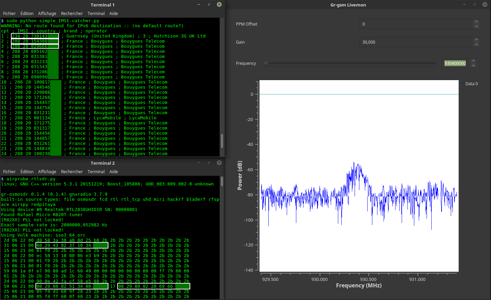

# IMSI-catcher

Este programa te muestra los números IMSI, el país, la marca y el operador de los teléfonos celulares de tu zona.

/!\ Este programa fue diseñado para comprender el funcionamiento de las redes GSM. ¡No apto para hackers de bajo perfil!



## Qué necesitas

1 PC con GNU/Linux. Probado con:
- Debian 10
- Ubuntu 20.04/LinuxMint 20+
- Kali 2020+

1 receptor SDR. Probado con:
- [Llave USB DVB-T (RTL2832U)](https://osmocom.org/projects/sdr/wiki/rtl-sdr) con antena (menos de 15 $)
- [Teléfono OsmocomBB](https://osmocom.org/projects/baseband/wiki/Phones)
- [HackRF](https://greatscottgadgets.com/hackrf/)
- [BladeRF](https://www.nuand.com/bladerf-2-0-micro/)

## Configuración

```bash
git clone https://github.com/undefined-name12/catcher-imsi.git
cd catcher-IMSI
```
o
```bash
wget https://github.com/undefined-name12/catcher-IMSI/archive/master.zip && unzip -q master.zip
cd catcher-IMSI-master
```

```bash
sudo apt install python3-numpy python3-scipy python3-scapy
```
Advertencia: ¡No uses Python 3.9 (error de ctypes)!

Puedes elegir entre dos tipos de instalación de gr-gsm: en tu sistema operativo o con Docker.

### Instalar gr-gsm en su sistema operativo (recomendado)

```bash
sudo apt-get install -y \
cmake \
autoconf \
libtool \
pkg-config \
build-essential \
python-docutils \
libcppunit-dev \
swig \
doxygen \
liblog4cpp5-dev \
gnuradio-dev \
gr-osmosdr \
libosmocore-dev \
liborc-0.4-dev \
swig
```
```bash
gnuradio-config-info -v
```
if >= 3.8
```bash
git clone -b maint-3.8 https://github.com/veligchkov/gr-gsm.it
```
else (3.7)
```bash
git clone https://git.osmocom.org/gr-gsm
```

```bash
cd gr-gsm
mkdir build
cd build
cmake ..
make -j 4
sudo make install
sudo ldconfig
echo 'export PYTHONPATH=/usr/local/lib/python3/dist-packages/:$PYTHONPATH' >> ~/.bashrc
```

### Instalar gr-gsm con Docker

```bash
sudo xhost +local:docker
docker pull atomicpowerman/imsi-catcher
docker run -ti --net=host -e DISPLAY=$DISPLAY --privileged -v /dev/bus/usb:/dev/bus/usb atomicpowerman/imsi-catcher bash
```
Ejecutar todos los `grgsm_*` en este contenedor. ## Uso

Utilizamos `grgsm_livemon` para decodificar señales GSM y `simple_IMSI-catcher.py` para encontrar IMSI.

```bash
python3 simple_IMSI-catcher.py -h
```
```
Uso: simple_IMSI-catcher.py: [opciones]

Opciones:
-h, --help Mostrar este mensaje de ayuda y salir
-a, --alltmsi Mostrar TMSI sin IMSI (predeterminado: falso)
-i IFACE, --iface=IFACE
Interfaz (predeterminado: lo)
-m IMSI, --imsi=IMSI IMSI a rastrear (predeterminado: Ninguno, Ejemplo:
123456789101112 o "123 45 6789101112")
-p PORT, --port=PORT Puerto (predeterminado: 4729)
-s, --sniff Rastrear en la interfaz en lugar de escuchar en el puerto
(requiere acceso root/suid)
-w SQLITE, --sqlite=SQLITE
Guardar observado Valores IMSI en el archivo SQLite especificado
-t TXT, --txt=TXT Guarda los valores IMSI observados en el archivo TXT especificado
-z, --mysql Guarda los valores IMSI observados en la base de datos MySQL especificada (copia .env.dist a .env y edítalo)
```

Abre dos terminales. En la terminal 1
```bash
sudo python3 simple_IMSI-catcher.py -s
```

En la terminal 2
```bash
grgsm_livemon
```
Ahora, cambia la frecuencia hasta que se muestre en la terminal algo así:
```
15 06 21 00 01 f0 2b 2b 2b 2b 2b 2b 2b 2b 2b 2b 2b 2b 2b 2b 2b 2b 2b 2b
25 06 21 00 05 f4 f8 68 03 26 23 2b 2b 2b 2b 2b 2b 2b 2b 2b 2b 2b 2b
49 06 1b 95 cc 02 f8 02 01 9c c8 03 1e 57 a5 01 79 00 00 1c 13 2b 2b
```

### Wireshark

Puedes ver paquetes GSM con Wireshark. ```bash
sudo apt install wireshark
sudo wireshark -k -Y '!icmp && gsmtap' -i lo
```

### Buscar frecuencias

```bash
grgsm_scanner
```
```
ARFCN: 974, Freq: 925.0M, CID: 2, LAC: 1337, MCC: 208, MNC: 20, Pwr: -41
ARFCN: 976, Freq: 925.4M, CID: 4242, LAC: 1007, MCC: 208, MNC: 20, Pwr: -45
```
Ahora puede configurar la frecuencia para `grgsm_livemon`:
```bash
grgsm_livemon -f 925.4M
```

O, para hackrf, descargue la herramienta kalibrate-hackrf de la siguiente manera:
```bash
sudo apt-get install automake autoconf libhackrf-dev
git clone https://github.com/scateu/kalibrate-hackrf
cd kalibrate-hackrf/
./bootstrap
./configure
make
sudo make install
```
Ejecute
```bash
kal -s GSM900
```
```
kal: Buscando estaciones base GSM-900. GSM-900:
canal: 14 (937,8 MHz + 10,449 kHz) potencia: 3327428,82
canal: 15 (938,0 MHz + 4,662 kHz) potencia: 3190712,41
...
```

### Registrar datos en MySQL

Utilice `db-example.sql` para crear su base de datos.

```bash
cp .env.dist .env
nano .env
# Configura tu configuración
sudo apt install python-decouple python3-mysqldb
```

```bash
sudo python3 simple_IMSI-catcher.py -s --mysql
```

### scan-and-livemon (ya no se usa)

Escanea frecuencias y escucha la primera que encuentres:

En la terminal 1
```bash
python3 scan-and-livemon
```

En la terminal 2
```bash
python3 simple_IMSI-catcher.py
```

# Enlaces

Configuración de Gr-Gsm: https://osmocom.org/projects/gr-gsm/wiki/Installation y https://github.com/velichkov/gr-gsm
Frecuencia: http://www.worldtimezone.com/gsm.html y https://fr.wikipedia.org/wiki/Global_System_for_Mobile_Communications
Código de red móvil: https://en.wikipedia.org/wiki/Mobile_Network_Code
Scapy: http://secdev.org/projects/scapy/doc/usage.html
IMSI: https://fr.wikipedia.org/wiki/IMSI
Realtek RTL2832U: https://osmocom.org/projects/sdr/wiki/rtl-sdr y http://doc.ubuntu-fr.org/rtl2832u y http://doc.ubuntu-fr.org/rtl-sdr
